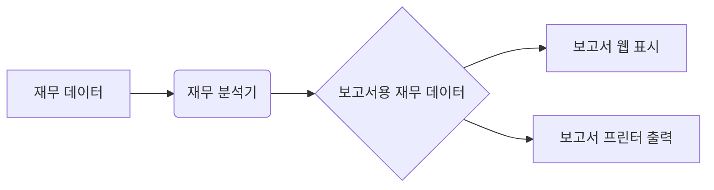
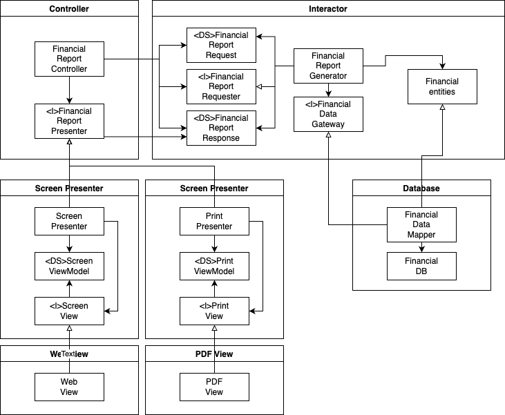

# OCP: 개방-폐쇄 원칙(Open-Closed Principle)

## OCP: 개방-폐쇄 원칙

`소프트웨어 개체(artifact)는 확장에는 열려있고 변경에는 닫혀있어야 한다.`

* 소프트웨어 개체의 행위는 확장할 수 있어야 하지만 개체를 변경해선 안됨
* 간단한 요구사항 확장을 위해 소프트웨어를 엄청나게 수정하는 일이 없도록 함

### 사고 실험

* 재무제표를 웹페이지로 보여주는 시스템
* 데이터 스크롤 가능
* 음수는 빨간색으로 출력
* 액터가 동일한 정보를 보고서 형태로 변환하여 흑백 프린터 출력을 요청
* 새로 코드를 작성할 때 원래 있던 코드의 변경량이 가능한 최소가 되도록함(이상적으론 0)

* 보고서 생성이 두개의 책임으로 분리됨
* 보고서용 데이터 계산하는 책임 / 웹 혹은 프린트에 적하하게 표현하는 책임
* 두 책임 중 하나에서 변경이 발생하더라도 다른 하나는 변경되지 않도록 소스 코드 의존성을 조직화해야함

* 처리 과정을 클래스 단위로 분할
* 클래스를 컴포넌트 단위로 구분
* `<I>` = 인터페이스
* `<DS>` = 데이터 구조
* → =  구현 및 상속 관계
* ⇾ = 사용 관계
* A 클래스에서 B클래스를 호출한다면 B클래스에선 A클래스를 전혀 호출하지 않음
* 모든 컴포넌트 관계는 단방향으로 이루어짐
* 변경으로부터 보호하려는 컴포넌트를 향하도록 되어있음
* Interactor 입장에선 Controller가 부수적임
* Controller 입장에선 Presenter가 부수적임
* Presenter 입장에선 View가 부수적임

Interactor는 가장 높은 수준의 개념이며 최고 보호를 받는다. View는 낮은 수준의 개념중 하나이며 거의 보호받지 못한다. 아키텍트는 기능이 어떻게, 왜, 언제 발생하는지에 따라 기능을 분리하고 분리한 기능을 컴포넌트의 계층구조로 조직화한다.

### 방향성 제어

FinancialDatagateway 인터페이스는 의존성 역전을 위해 FinancialReportGenerator와 FinancialDataMapper 사이에 위치한다. FinancialDatagateway가 없었다면 의존성이 Interator 컴포넌트에서 Database 컴포넌트로 바로 향하게 된다.

### 정보은닉

FinancialReportReuester 인터페이스는 FinancialReportController가 Interactor 내부에 대해 너무 많이 알지 못하도록 막기위해 존재한다. 해당 인터페이스가 없었다면 Controllersms FinancialEntities에 추이 종속성을 가지게 된다.
이는 '자신이 직접 사용하지 않는 요소에 절대로 의존해선 안된다'는 소프트웨어 원칙을 위반하게 된다.

Controller 변경으로부터 Interactor를 보호하는것이 우선순위가 가장 높고, Interactor의 변경으로부터 Controller도 보호하기 위해 Interactor 내부를 은닉한다.

### 결론

* OCP는 시스템의 아키텍처를 지탱하는 원동력 중 하나임
* OCP의 목표는 시스템 확장성과 변경으로 인해 영향을 받지 않도록 하는데 있음
* 컴포넌트 단위 분리
* 저수준 컴포넌트에서 발생한 변경사항으로부터 고수준 컴포넌트를 보호할 수 있는 형태의 의존성 계층구조가 필요함
