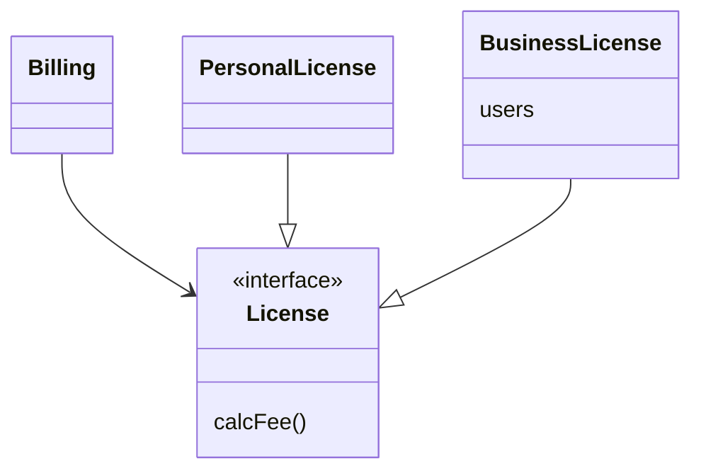
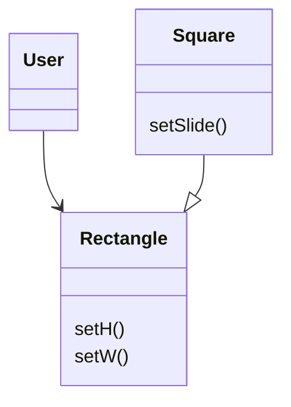

# LSP: 리스코프 치환 원칙(Liskov Substitution Principle)

## LSP: 리스코프 치환 원칙

* 치환(substitution) : 어떤 부분에 그와 대등한 무언가를 바꿔 넣는 행위
* S 타입의 객체 o1
* 각각에 대응하는 T 타입 객체 o2
* T 타입을 이용해서 정의한 모든 프로그램 P

`P애서 o2의 자리에 o1을 치환 하더라도 P의 행위가 변하지 않는다면 S는 T의 하위 타입이다.`

### 상속을 사용하도록 가이드하기

* License 클래스는 calcFee() 메서드를 가지고 있음
* Billing은 calcFee() 메서드를 호출함
* Licenses 클래스는 PersonalLicense, BusinessLicense 하위 타입 존재
* 두 가지 하위 타이은 서로 다른 알고리즘을 이용해 라이선스 비용 계산



* LSP를 준수함 Billing
* 애플리케이션 행위가 License 하위 타입 중 무엇을 사용하는지에 전혀 의존 않음

`하위 타입은 모두 License 타이을 치환할 수 있다.`

### 정사각형/직사각형 문제



* LSP 위반
* Square는 Rectangle의 하위 타입으로 적합하지 않음
* Rectagle 높이, 너비는 독립적으로 변경
* Square 높이, 너비는 함께 변경

```java
Rectangle r = ...
r.setW(5);
r.setH(2);
assert(r.area() == 10);

// Square를 생성하면 assert문 실패
```

LSP 위반을 막기 위해 Rectangle이 Square인지 검사하는 메커니즘을 User에 추가해야 한다. 그렇게 되더라도 User의 행위가 사용하는 타입에 의존하게 되므로 타이을 서로 치환할 수 없게 된다.

### LSP와 아키텍처

`LSP 원칙을 어겼을 때 시스템 아키텍처에서 무슨 일이 일어나는지 관찰해야한다.`

### LSP 위배 사례

* 택시 파견 서비스를 통하하는 애플리케이션
* 고객은 택시 업체와 상관없이 자신의 상황에 가장 적하한 택시를 찾음
* 고객이 택시를 결정하면 REST 서비스를 통해 고객 위치로 파견함
* 택시 파견 REST URI는 운전기사 DB에 저장되어 있음

```txt
// REST URI
purplecab.com/driver/Bob

// PUT 호출
purplecab.com/driver/Bob
    /pickupAdress/24 Maple St.
    /pickupTime/153
    /destinatnion/ORD
```

* 모든 택시어체는 pickupAdress, pickupTime, destinatnion 필드를 동일한 방식으로 처리해야함
* 만약 특정 업체에서 축약해서 사용했다면?
* 특정 업체에서 인수가 이루어져 회사 시스템을 통하한다면?

`아키텍트는 여러 버그로부터 시스템을 격리해야 한다.`

### 결론

* LSP는 아키텍처 수준까지 반드시 확장해야함
* 치환 가능성이 위배되는 순간 별도의 메커니즘을 추가해야 하기 때문
