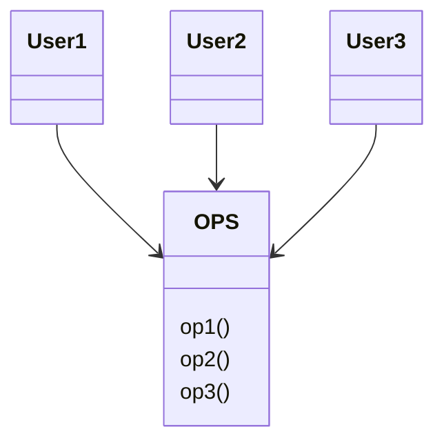
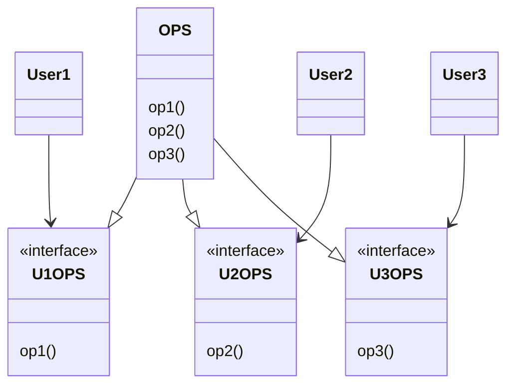

# ISP: 인터페이스 분리 원칙(Interface Segregation Principle)

## ISP: 인터페이스 분리 원칙

* 다수의 사용자가 OPS 클래스 오퍼레이션을 사용함
* User1 -> op1, User2 -> op2, User3 -> op3 사용한다는 가정
* OPS는 정적 타입 언어로 작성됨
* User1에서 op2, op3를 전혀 사용하지 않음에도 두 메서드에 의존하게됨

`op2의 소스코드가 변경되면 변경사항이 없는 User1도 다시 컴파일 후 재배포 해야한다.`

* 오퍼레이션을 인터페이스 단위로 분리하여 해결
* User1은 U1OPS와 op1에 의존하지만 OPS에는 의존하지 않게됨
* OPS 변경사항이 User1과 관계가 없는 경우 재배포 하지 않아도됨

### ISP와 언어

* 정적 타입 언어는 import, use, include와 같은 타이 선언문을 사용하도록 강제함
* 소스코드에 include된 선언문으로 인하여 소스 코드 의존성 발생

`동적 타입 언어`를 사용하면 유연하며 결하도가 낮은 시스템을 만들 수 있다. ISP는 아키텍처가 아닌 언어와 관련된 문제로 볼 수 있다. 다만 ISP는 언어 종류에 따라 영향받는 정도가 다르다.

### ISP와 아키텍처

* 필요 이상으로 많은 걸 포함하는 모듈에 의존하는 것은 좋지않음
* 소스코드 의존성 뿐만 아니라 아키텍처 수준에서도 동일한 상황이 발생할 수 있음

### 결론

`불필요한 짐을 실은 무언가에 의존하면 예상치 못한 문제에 빠진다.`
