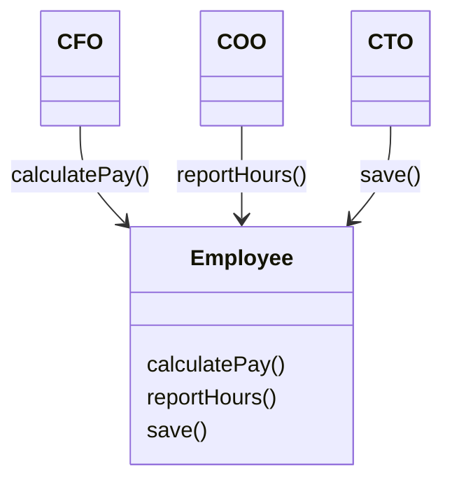
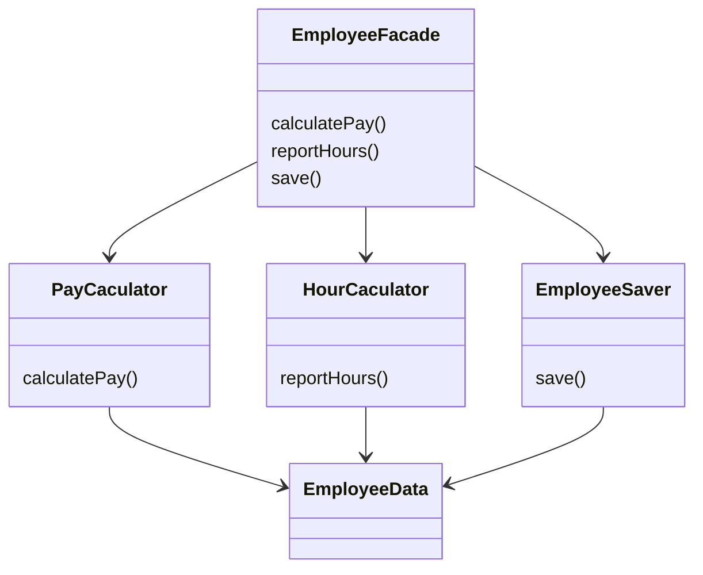

# SRP: 단일책임 원칙(Single Responsibility Principle)

## SOLID

* 함수와 데이터 구조를 클래스로 배치하는 방법, 클래스를 서로 결합하는 방법을 설명
* 클래스는 단순히 함수와 데이터를 결합한 집합을 가리킴
* 변경에 유연함
* 이해하기 쉬움
* 컴포넌트 기반

### SOLID 원칙

* SRP: 단일책임 원칙(Single Responsibility Principle)
  * 소프트 웨어 시스템이 가질 수 있는 최적의 구조는 시스템을 만드는 조직의 사회적 구조에 영향을 받으므로 소프트웨어 모듈은 변경의 이유가 단 하나여야만함

* OCP: 계방-폐쇄 원칙(Open-Closed Principle)
  * 기존 코드를 수정하기 보단 새로운 코드를 추가하는 방식으로 시스템의 행위를 변경할 수 있도록 설계함

* LSP: 리스코프 치환 원칙(Liskov Substitution Principle)
  * 상호 대체 가능한 구성요소를 이용해 소프트웨어 시스템을 만들 수 있으려면, 이들 구성요소는 반드시 서로 치환 가능해야 한다는 계약을 지켜야함

* ISP: 인터페이스 분리 원칙(Interface Segregation Principle)
  * 이 원칙을 따르면 소프트웨어 설계자는 사용하지 않은 것에 의존하지 않아야함

* DIP: 의존성 역전 원칙(Dependency Inversion Principle)
  * 고수준 정책을 구현하는 코드는 저수준 세ㅜ사항을 구현하는 코드에 절대 의존해서는 안되고 세부사항 정책에 의존해야함

### `SRP: 단일 책임 원칙`

* 단일 모듈은 `변경의 이유`가 단 하나여야만함
* 변경의 이유란 `사용자와 이해관계자`를 가리킴
* 하나의 모듈은 단 하나의 사용자 또는 이해관계자에 대해서만 책임져야함
* 사용자와 이해관계자는 변경을 요청하는 한명 이상의 사람들을 가리킴(actor)
* 하나의 모듈은 단 하나의 액터에 대해서만 책임져야함

### 징후1: 우발적 중복

* 이 클래스는 SRP 위반임
* 서로 매우 다른 3명의 액터를 책임지기 때문
  * calculatePay() 메서드는 회계팀에서 기능을 정의하고 CFO의 보고를 위해 활용됨
  * reportHours() 메서드는 인사팀에서 기능을 정의하고 COO의 보고를 위해 활용됨
  * save() 메서드는 DBA가 기능을 정의하고 CTO 보고를 위해 활용됨

Employee 단일 클래스에 세 액터가 결합되어 CFO 팀에서 결정한 조치가 COO팀이 의존하는 무언가에 영향을 줄 수 있다. 이러한 문제는 서로 다른 액터가 의존하는 코드를 너무 가까이 배치했기 때문이다. SRP는 서로 다른 액터가 의존하는 코드를 서로 분리하라고 말한다.

### 징후2: 병합

* 소스 파일에 다양하고 많은 메서드가 포함되면 병합이 자주 발생됨
* 메서드가 서로 다른 액터를 책임지는 경우 병합 발생 가능성이 높아짐
* 어떤 도구도 병합이 발생하는 모든 경우를 해결 할 수는 없음
* 병합에는 항상 위험이 뒤따르게됨
* 많은 사람이 다른 목적으로 동일한 소스 파일을 변경하는 경우
* 서로 다른 액터를 뒤받침 하는 코드를 서로 분리

* 세 클래스는 서로의 존재를 몰라야함
* EmployeeFacade 클래스는 세 클래스의 객체를 생성하고 요청된 메서드를 가지는 개체로 위임하는 일을 책임
* EmployeeData 클래스는 메서드가 없는 간단한 데이터 구조이며 세 개의 클래스가 공유하도록 돕는 역할
* 문제의 해결방식은 이외에도 다양함

메서드가 하나의 가족을 이루고, 메서드의 가족을 포함하는 각 클래스는 하나의 유효범위가 된다. 유효범위 바깥에선 가족에게 감춰진 식구가 있는지 전혀 알수 없다.

### 결론

* 단일 책임 원칙은 메서드와 클래스 수준의 원칙임
* 컴포넌트 수준에선 공통 폐쇄 원칙(Common Closure Principle)
* 아키텍처 수준에선 아키텍처 경계의 생성을 책임지는 변경의 축이 됨
