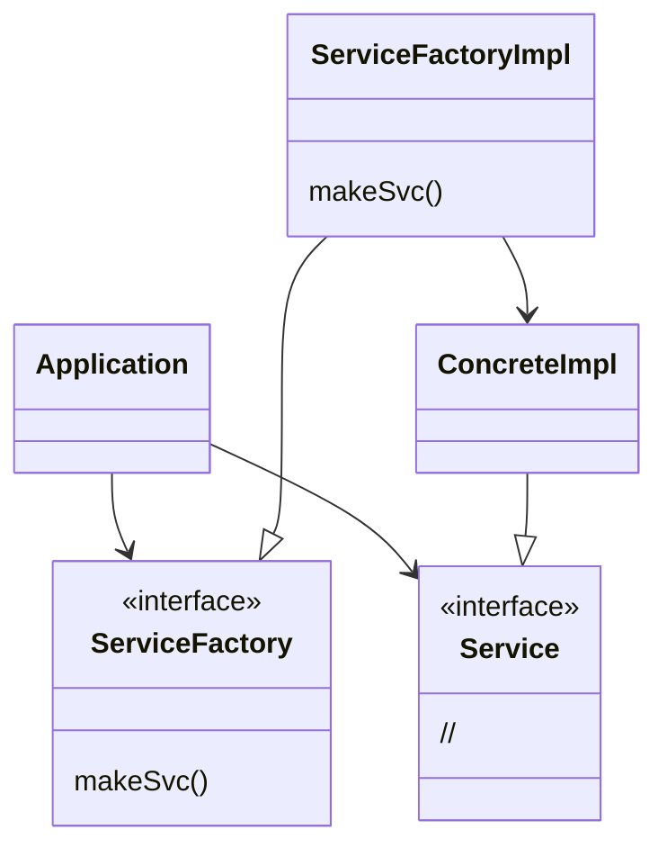

# DIP: 의존성 역전 원칙(Dependency Inversion Principle)

## DIP: 의존성 역전 원칙

`유연성이 극대화된 시스템`이란 소스 코드 의존성이 추상(abstraction)에 의존하며 구체(concretion)에는 의존하지 않는 시스템이다.

* 정적 타입 언어에서 선언문은 오직 인터페이스나 추상 클래스 같은 추상적인 선언만 참조해야함
* 구체적인 대상에는 절대 의존해서는 안됨
* 동적 타입 언어에도 동일한 규칙이 적용됨

DIP는 운영체제 혹은 플랫폼 같이 안정성이 보장된 환경에 대해서는 무시하는 편이다. 변경되지 않는다면 의존할 수 있다.

의존성을 피하고자 하는 것은 `변동성이 큰 구체적 요소`이다.

### 안정된 추상화

* 인터페이스는 구현체보다 변동성이 낮음
* 인터페이스의 변동성을 낮추기 위해 노력해야함
  * 변동성이 큰 구체 클래스 참조하지 말고 추상 인터페이스를 참조할 것
    * 추상 팩토리(Abstract Factory)를 사용하도록 강제함
  * 변동성이 큰 구체 클래스로부터 파생하지 말 것
    * 정적 타입 언어에서 상속은 변경이 어려우므로 신중하게 사용해야함
  * 구체 함수를 오버라이드 하지 말 것
    * 구체 함수는 소스코드 의존성을 필요로 함
    * 추상 함수로 선언하고 구현체들에서 각자의 용도에 맞게 구현
  * 구체적이며 변동성이 크다면 절대로 이름을 언급하지 말 것

### 팩토리
  
* 자바 등 대다수 객체 지향 언어에서 바람직하지 못한 의존성을 처리할 때 추상 팩토리를 사용함

* Application은 Service 인터페이스를 통해 ConreteImpl을 사용
* Application은 ConcreteImpl 인스턴스를 반드시 생성해야함
* Application은 ServiceFactory 인터페이스에 makeSvc()를 호출
* makeSvc메서드는 ServiceFactory에서 파생된 ServiceFactoryImpl에서 구현
* ServiceFactoryImpl 구현체가 ConcreteImpl 인스턴스를 생성하여 Service 타입으로 반환

시스템을 두 가지 컴포넌트로 분리하였다. 하나는 Impl이 붙어있는 구체 컴포넌트와 추상 컴포넌트이다. 추상 컴포넌트는 고수준 업무 규칙을 포함한다. 구체 컴포넌트에선 규칙을 다루기 위한 모든 세부사항을 포함한다.

소스 코드 의존성은 제어 흐름과 반대 방향으로 역전된다.

### 구체 컴포넌트

* 구체 컴포넌트는 구체적인 의존성이 하나 있므로 DIP 위배됨
* DIP 모든 위배를 없앨 수는 없음
* 컴포넌트는 main 함수를 포함하기 때문에 Main이라 부름
* main 함수가 ServiceFactoryImpl 인스턴스 생성
* ServiceFactory 타입으로 전여견수에 저장
* Application에서 전역 변수를 이용해 ServiceFactoryImpl에 접근

### 결론

* DIP는 아키텍처 다이어그램에서 가장 누에 드러나는 원칙임
* 의존성은 더 추상적인 엔티티가 있는 쪽으로 향함
